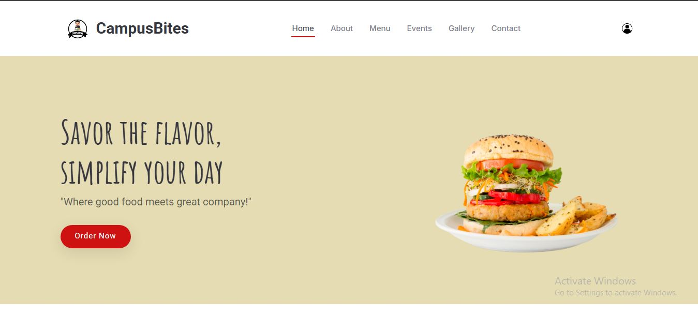
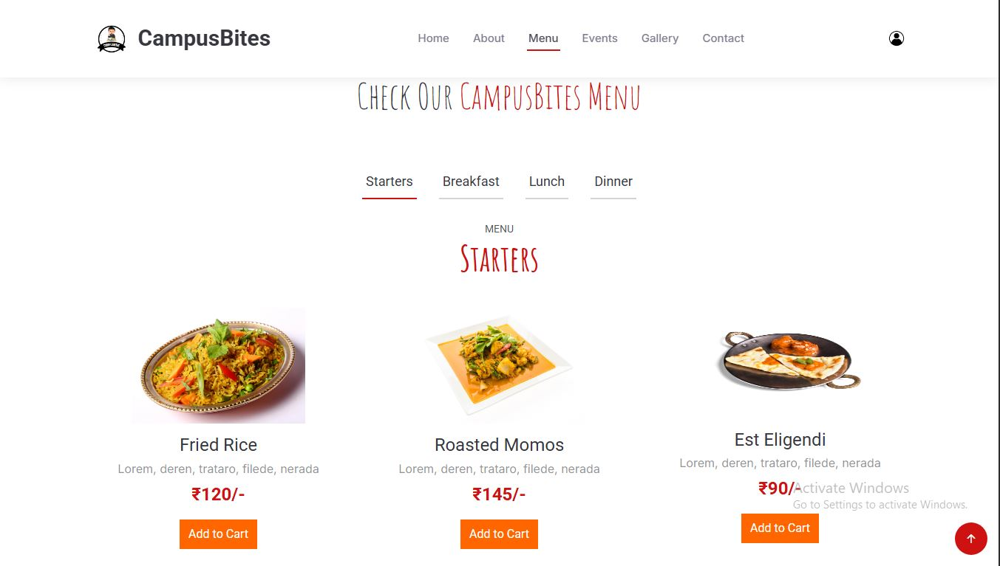

# 🍽️ CampusBites – Canteen Management System (Frontend)

A responsive and user-centric **canteen management system interface** designed to streamline food browsing and improve the overall user experience in a college environment.

This project emphasizes **clean UI design, responsiveness, and structured frontend development**, making it suitable as a base for real-world application integration.

---

## 🚀 Key Highlights

* 📱 Fully responsive across mobile, tablet, and desktop devices
* 🎯 Clean, intuitive, and user-friendly interface
* ⚡ Optimized layout for smooth navigation and performance
* 🧩 Well-structured and scalable codebase
* 🎨 Modern UI built using Bootstrap and custom styling

---

## 🛠️ Tech Stack

* **HTML5** – Semantic structure
* **CSS3** – Styling, layout, and responsiveness
* **JavaScript (Basic)** – Interactive elements
* **Bootstrap** – Responsive UI framework

---

## 📂 Project Structure

```
CampusBites/
│── index.html  
│── assets/  
│   ├── css/  
│   ├── js/  
│   ├── img/  
│   └── vendor/  
```

---

## 🎯 Project Objective

The primary objective of this project is to develop a **frontend prototype** that:

* Enhances user interaction with menu items
* Provides a scalable foundation for backend integration
* Demonstrates practical implementation of frontend development concepts

---

## 📸 Preview

### Home Page


### Menu Section

---

## 🔮 Future Enhancements

* 🔐 User authentication system
* 🛒 Online ordering functionality
* 💳 Payment gateway integration
* 📊 Admin dashboard for canteen management
* ⚙️ Backend integration (Node.js / Firebase)

---

## 👨‍💻 Author

**Gourav Singh**
B.Tech CSE (AI & ML)

---

## ⭐ Note

This project is a **frontend-focused implementation** developed as part of academic learning, showcasing fundamental skills in UI design, responsiveness, and web development best practices.
